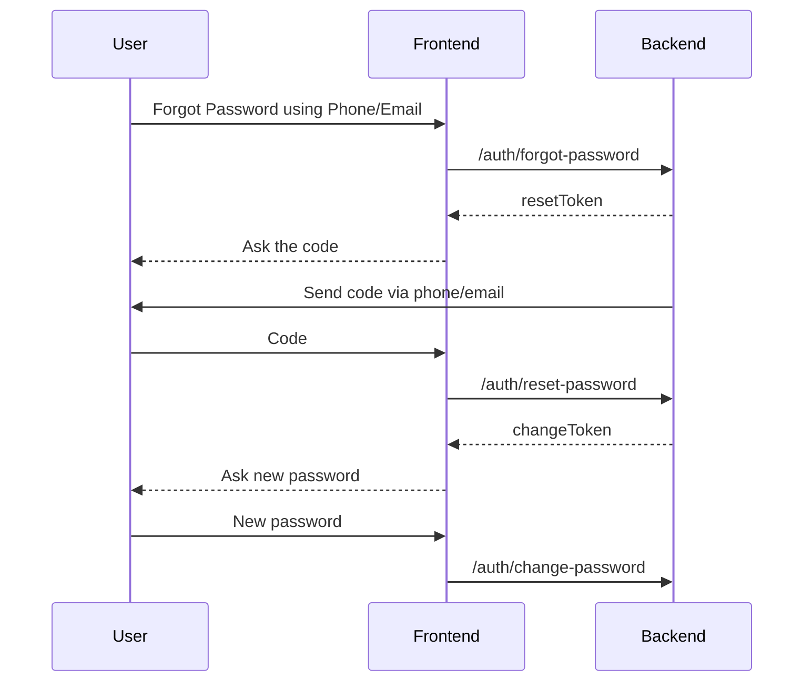
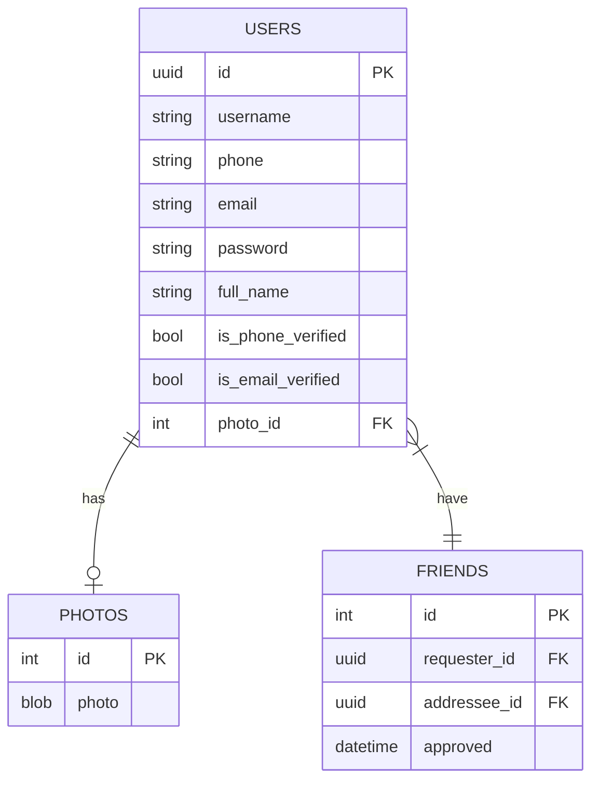

# Backend Test

## Diagrams

### Sequence Diagram

#### Forgot Password



### Entity Relationship Diagram

- All table have timestamps (create, update, dekete) and it is omitted unless necessary for verbosity.



## Endpoints

- Common error response:
  ```
  {
    error: string;    // error code
    message: string;  // message for user
  }
  ```

### Auth

- Default error if not specified is `unauthorized`.

#### Login

- Login Token

  ```
  POST /auth/token

  Payload: {
    username | phone | email: string;
    password: string;
  }

  Return: {
    accessToken: string;
    expiresIn: number;
  }
  ```

#### Registration

- Register

  ```
  POST /auth/register

  Payload: {
    username?: string;
    phone?: string;
    email?: string;
    password: string;
  }

  Return: {
    accessToken: string;
    expiresIn: number;
  }
  ```

  Code will be send to phone/email.

- Phone/Email Verification

  ```
  POST /auth/verify

  Payload: {
    phone | email: string;
    code: string;
  }

  Return: No Content

  Error:
  - code-expired
  ```

#### Forgot Password

- Forgot Password

  ```
  POST /auth/forgot-password

  Payload: {
    phone | email: string;
  }

  Return: {
    resetToken: string;
    expiresIn: number;
  }
  ```

  Code will be send to the phone/email.

- Reset Password

  ```
  POST /auth/reset-password

  Payload: {
    resetToken: string;
    code: string;
  }

  Return: {
    changeToken: string;
    expiresIn: number;
  }
  ```

- Change Password

  ```
  POST /auth/change-password

  Payload: {
    oldPassword | changeToken: string;
    newPassword: string;
  }

  Return: No Content
  ```

### User

- Change Profile

  ```
  POST /me/profile

  Payload: {
    email?: string;
    phone?: string;
    fullName?: string;
    photo?: blob;
  }

  Return: No Content
  ```

  Code will be send to the phone/email if its changed.

- Request Code to verify Phone/Email

  ```
  GET /me/verify

  Query: {
    field: 'phone' | 'email';
  }

  Return: No Content
  ```

  Code will be send to the phone/email only if its not verified.
