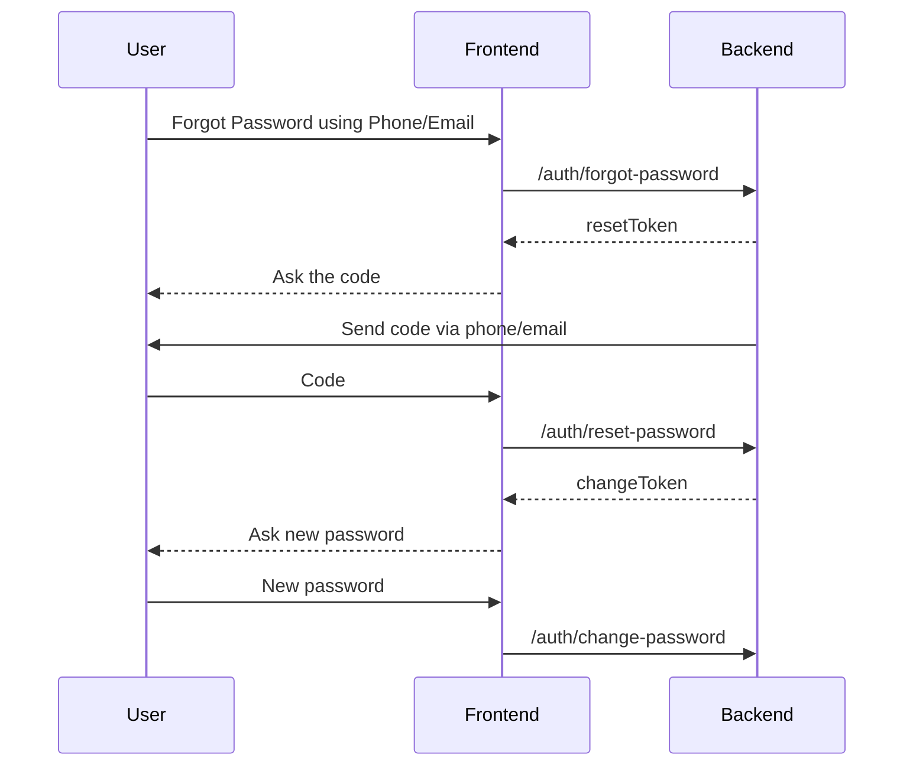

# Backend Design Test

## Assumptions

### Functionality

- Auction feature:
  - Will be just a simple booking with payment higher than current active booking amount.
  - The payment must be a minimum current active booking amount plus minimum auction charge for that table.
  - The payment must be made in full.
- Voucher system:
  - Voucher with simple constraints.
  - User eligibility based on rank map.

### Technicallity

- Auth managed with simple design to show case sequence diagram.
  - In reality should use provider like Firebase Identity.
- Venue details (name, address, rating, distance) using Google Maps API.

## Diagrams

### Sequence Diagram

#### Forgot Password

### Entity Relationship Diagram

[View ERD](https://aditbisa.github.io/backend-design-test/erd.svg)

## Endpoints

[View API](https://aditbisa.github.io/backend-design-test/api.html)
